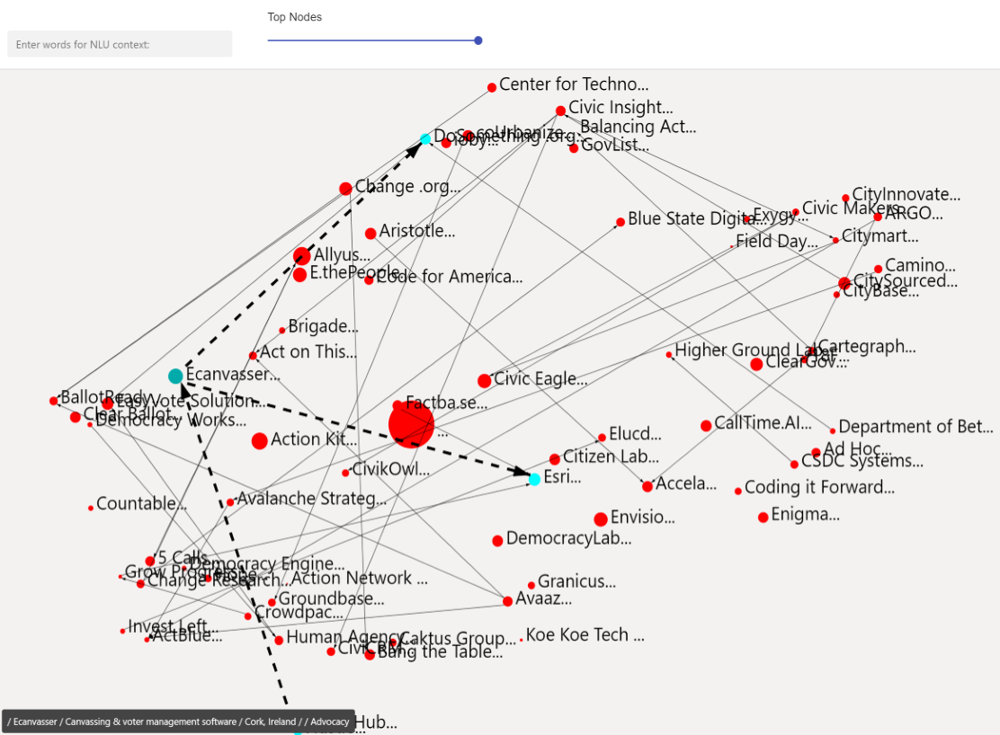

# Instructions
- The block begins by mapping all the records from the view shown. We recommend you start with a small number of records. The current release does not scale well into triple digit counts. The next release will replace the projection algorithm to support larger record counts. 
- Best way to start is by entering some context in the input box. 
- You can use the slider to change the number of top nodes, in terms of their semantic proximity to the current context.
- Hover over a node to see its dependent relationships and neighbours. A tooltip will show in the bottom-left with the full text information of that node
- Click a node to expand the record
- You can pan and zoom 
- The base has to have a minimum of 5 entries for the algorithms to start working. 

# What it does

Simply put, it lets users build and navigate knowledge through their bases. It uses deep net algorithms to present latent (hidden) relationships behind many records, but more importantly for the purpose of letting the user build knowledge using linked records, and then explore connectivity that spans many hops, not just direct or over a couple of links. It also shows users likely related records that may not be yet linked manually. 

The block was built so as not to send any data out of the DB or browser for processing anywhere outside. However, this is also why it takes longer to compute than it could. A version using cloud APIs would be much faster but also more intricate for the average user to get going in terms of tech, licensing, privacy, etc. This block allows users to immediately apply this tech to their bases and consider how to scale from there. 

The hope is it will be useful at the point when a user has grown their base beyond search-by-scrolling. Views are very helpful but they end at keyword matching and fixed categorization logic. With time, the terminology and schemes used by users drift and start missing marks. The block extends from there with semantic and contextual search and UI. 

# How it is built
This block was made possible thanks to the awesome examples provided by the Airtable team, and awesome ports of the key algorithms to JavaScript by the open-source community. The first key algorithm is the Universal Sentence Encoder (USE) which is trained on GBs of English language and projects any sentence into a 512-dimensional vector space so that one can calculate similarities and other relationships. In particular a mini version of USE with 8K vocabulary and able to run out of ~25MBs. The next key algorithm is UMAP dimensionality reduction which can take the 512D vectors and project them into a 2D space, so we can plot them so that our eyes can intuitively pick-up even more relationships. Therefore, the block weaves the power of machine and human intelligence.

# How to remix this block
1. Create a new base (or you can use an existing base).

2. Create a new block in your base (see [Create a new block](https://airtable.com/developers/blocks/guides/hello-world-tutorial#create-a-new-block),
   selecting "Remix from Github" as your template.

3. From the root of your new block, run `block run`.

